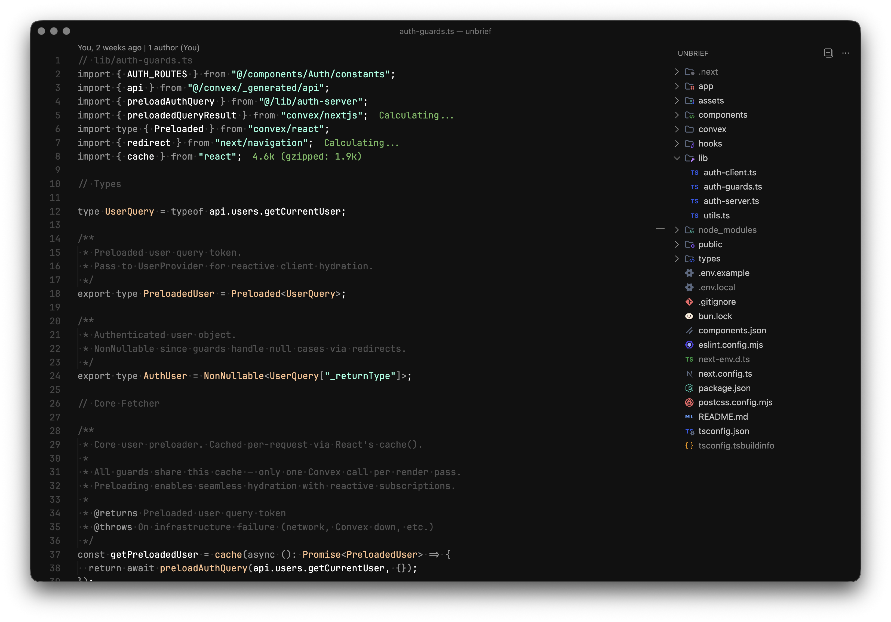

# VS Code Configuration Bootstrap

This repository contains a complete, opinionated Visual Studio Code setup:

- Editor settings
- Keybindings
- Required extensions

The entire setup is applied using a single script: `install.sh`.

This repository is intended to be:

- Public
- Reproducible
- OS-aware (macOS, Linux, Windows via Git Bash / WSL)
- Independent of VS Code Settings Sync

---

## Repository Structure

vscode-config/
├─ README.md
├─ install.sh
├─ extensions.txt
└─ .vscode/
├─ settings.json
└─ keybindings.json

---

## Requirements

### 1. Visual Studio Code

Install Visual Studio Code from the official website:

https://code.visualstudio.com/

---

### 2. Enable the `code` command (REQUIRED)

The installer relies on the `code` CLI being available in your shell.

#### macOS

1. Open Visual Studio Code
2. Press Cmd + Shift + P
3. Run:
   Shell Command: Install 'code' command in PATH
4. Restart your terminal

#### Linux

Most package managers install `code` automatically.
If not, open VS Code and run the same command as above from the Command Palette.

#### Windows

Ensure you are using:

- Git Bash, or
- WSL

The `code` command is added automatically during installation if the option
"Add to PATH" was enabled.

---

### Verify the command

Run:

code --version

If this prints a version number, you are good to go.

---

## Installation

### Step 1: Get the repository

You can clone the repo using git:

git clone https://github.com/Y1am0/vscode-config.git
cd vscode-config

---

### Step 2: Run the installer

./install.sh

What the script does:

- Detects your operating system
- Locates the correct VS Code user configuration directory
- Installs all extensions listed in extensions.txt
- Applies settings.json
- Applies keybindings.json

---

### Step 3: Restart VS Code

Restart Visual Studio Code to ensure all settings and keybindings are applied.

---

## Updating the Configuration

To update this setup in the future:

1. Modify files inside .vscode/
2. If extensions change, regenerate the list:

   code --list-extensions > extensions.txt

3. Re-run:

   ./install.sh

This repository is the single source of truth.

---

## Notes

- This setup intentionally does NOT rely on VS Code Settings Sync
- Everything is explicit, versioned, and reproducible
- Running install.sh multiple times is safe
